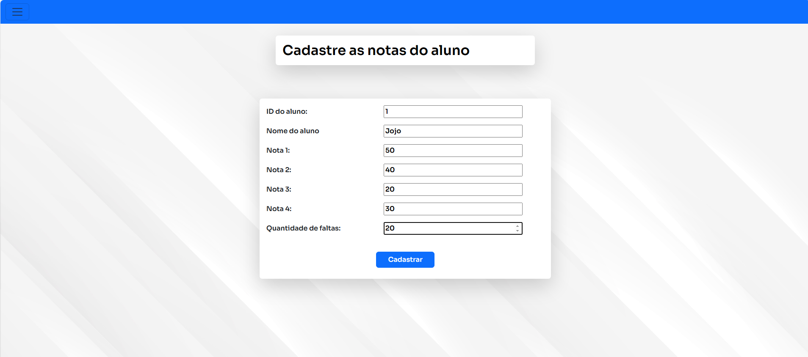

# LoginCertificadoCadastroNotas-Escola-PHP
um pequeno projeto para treinar PHP. com login de professor e aluno de um curso de linux e emissão de certificado. Banco de dados e PHP. Com o xampp e mysql. bem simplão
 

  <h3>Menu mostrando a parte para entrar na área do professor</h3>
  

  

  <h3>Menu mostrando a parte para entrar na área do aluno</h3>
  

  

  <h3>Login na área do professor</h3>
  

  

  <h3>Área para o professor colocar as notas</h3>
  

  

  <h3>Lista das notas que só o professor pode ver</h3>
  

  

  <h3>Login da área dos alunos</h3>
  

  

  <h3>Os alunos só podem ver notas</h3>
  

  

  <h3>Quando o aluno falta demais</h3>
  

  

  <h3>Quando o aluno não tira nota boa</h3>
  

  

  <h3>Com aluno inteligente, o certificado é liberado</h3>
  

  

  <h3>Área para solicitar certificado</h3>
  

  

  <h3>Certificado gerado na hora</h3>
  

